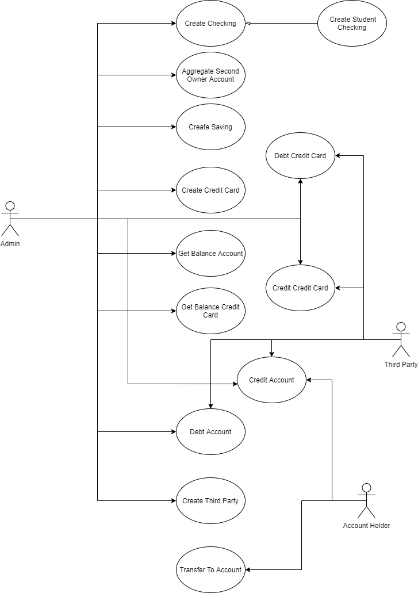
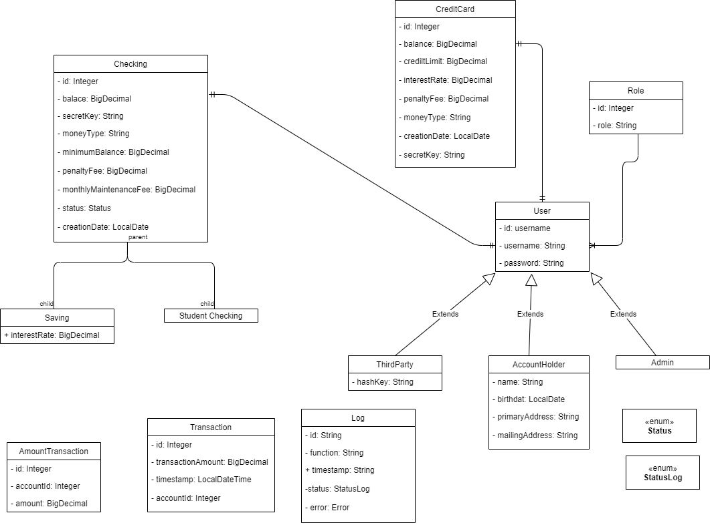

# Midtermproject
## Introduction
This project consists of the implementation of a small banking system. 
composed of the following part that we are going to explain

## Use Case

## Class Diagram

## Accounts
There are 4 different types of bank accounts

- Checking
- Student Checking
- Saving
- Credit Card

## Users
There are three types of users that can interact with the application:

- Admin
- AccountHolder
- ThirdParty

### Admin
This type of user is allowed to create all kinds of bank accounts. 
They can add a second owner to any bank account that does not have one. Admin 
are also allowed to add and subtract money from any bank account and finally 
they can create ThirdParties.

### AccountHolder
AccountsHolders can check the balance of their main bank accounts and can make 
transfers to other bank accounts if they have enough money.

### ThirdParty
ThirdParty can add and subtract money from any account when their hashKey and the 
secret key of the bank account in which they want to make the transaction are verified.

## Fraud
If a previous transaction is detected when making a transaction in a period of less than 
one second, it will be considered fraud and the bank account will be frozen.

Every night a batch is passed to detect if in the last 24 hours an increase of 150% of the 
total transaction amounts has been detected, comparing it with any other 24-hour period.

## Interest Rate

Every night a batch is run that adds the corresponding interest. If it is a saving account 
each year, the interest corresponding to each account is applied and if it is a student account it is applied every month

## Logging
The logs are stored in a NoSQL database (MongoDB). Both successful and failed transactions. 
They are also saved in a file located in the logs folder

## Data Base
To store the data, a h2 memory database has been chosen. A series of initial data will be loaded 
located in the file data.sql

## Postman
A json file is included with the application paths for testing

